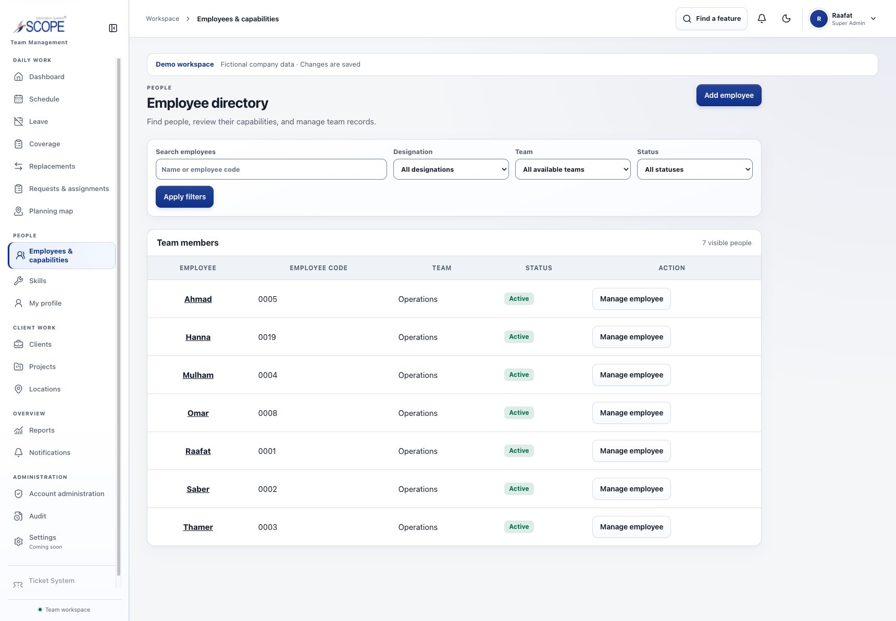

# Confirmed seven-person company roster — 2026-10-06

The product owner requested actual names and explicitly confirmed **only these seven people** at the existing primary address, [ScopeIs Team Management](https://scopeis-team-management-system.vercel.app/).

| Person | System role | Username | Login email |
|---|---|---|---|
| Raafat | Super Admin | raafat | raafat@example.test |
| Hanna | Super Admin | hanna | hanna@example.test |
| Saber | Admin | saber | saber@example.test |
| Thamer | Admin | thamer | thamer@example.test |
| Mulham | Employee | mulham | mulham@example.test |
| Omar | Employee | omar | omar@example.test |
| Ahmad | Employee | ahmad | ahmad@example.test |

The live workspace contains exactly seven active users, seven workforce profiles and seven credential records. Raafat replaces Nora, Saber replaces Ava, Thamer replaces Ben, Mulham replaces Cora and Ahmad replaces Dan. Their stable IDs and independently salted password hashes are preserved. Hanna's new account and Omar's newly enabled sign-in use the deployed application account-administration actions, including explicit Super Admin confirmation. Identifier changes revoke old sessions. Passwords and connection credentials are absent from this report, source and evidence.

The six example clients, twelve projects, six work locations, nineteen schedule periods and fifty-seven assignments remain available. Six visits on the base date use three Employees in non-overlapping two-hour intervals; current and previous Published months, upcoming Draft/Proposed work and the copied Cedar revision retain their identities and lifecycle. No travel-time policy is inferred. Saber retains four Client grants and Thamer two, with a shared three-person sample team pool. The two pending coverage requests now nominate Omar and Mulham; their participant-only threads follow those nominees. Four leave states, fifteen evidence records across five kinds, four management notes, six operational notes with their superseded versions and notifications remain coherent.

Four current private PDF examples now use Mulham and Ahmad in both filenames and content. The normal authorized replacement API preserves four archived file versions. The Demo workspace banner still identifies operational facts, qualifications, documents and coordinates as fictional. Actual names do not assert actual personal or professional facts. Hanna has no invented designation or skills.

## Operator custody and refusal boundaries

A private full database snapshot was saved outside the repository before hosted changes. The guarded [one-time roster correction](../../scripts/update-company-demo-roster.mjs) is restricted to the exact approved company database and complete canonical migration ledger. It requires the original fictional initialization marker, the twelve known extra sample IDs, original sample plans, seven expected credential records and Hanna's normal Super Admin account. It refuses unknown workforce records, extra employee file history, decided replacements and modified sample plans. A transaction, record locks and integrity checks protect the entire correction; dry runs and injected failures roll back. Only the known extra fictional people and their dependent fixture records are removed. Existing hashes remain unchanged and a safe `demo.company.roster.updated` event records the explicit fixture correction.

The correction is an operator action for this still-developmental simulation, not a new product workflow for rewriting Published work or transferring real employee history. Future initialization creates dataset version 2 directly. Rerunning initialization or correction preserves subsequent edits; build, request and deployment paths never reseed. The original recovery database, Preview checkout, prototype and unrelated files remain untouched.

## Verification

The [verification receipt](evidence/company-roster-2026-10-06/verification.json) records tested source hashes. Disposable-database tests exercise initialization, dry runs, failure rollback, target and existing-data refusal, v1 correction, password-hash preservation, idempotence and real domain journeys for all seven actors. Actual coverage decisions are tested only in the disposable database, including Draft effects and Published revision preservation; the hosted requests remain pending. Lint, type checking and diff checks pass. No application schema or runtime UI code changed.

The [live database proof](evidence/company-roster-2026-10-06/live-database.json) confirms seven people, the retained company records, four current/four archived files and zero missing profiles, invalid assignments, approved-leave conflicts or overlapping assignments. The [live access audit](evidence/company-roster-2026-10-06/live-access.json) signs in as every account and verifies 324 allowed pages, 35 permission refusals, six safe management-only explanations and 29 private-file checks, with zero errors. All seven names and six clients appear. This includes profiles, dashboards, published Employee schedules, management workspaces, reports and linked record details.

