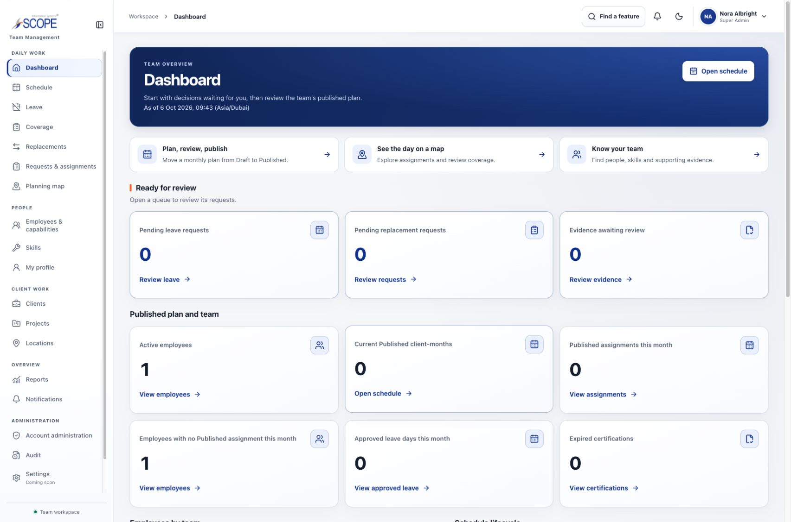

# Production sign-in cutover — 2026-10-06

## Outcome

`COMPLETED` for the approved production password sign-in journey. All five demo
accounts sign in, open the protected dashboard, and sign out successfully on
the live alias. Nora's Super Admin dashboard was also verified in Chrome.

The user authorized completion after encountering the live `AUTH_UNAVAILABLE`
503 response. The production environment had no `AUTH_PASSWORD_PEPPER`, and
the connected database had only migrations `0000` and `0001` with no credentials
table. The five approved users already existed, were active, and had the expected
Super Admin, Admin, and Employee roles.

## Verified target and recovery

- Vercel project: `prj_pE9utFkTQd6uulsVrDKoqsgmmKKd`, scope `mu-ka7`.
- Production alias: `https://scopeis-team-management-system.vercel.app`.
- Neon project: `morning-flower-68935124`, database `neondb`, production branch
  `br-empty-fog-avl4wjxn` (`main`).
- Recovery branch: `br-royal-voice-avjx5yd2`, named
  `scopeis-before-auth-20261006`, created from the production branch before
  mutation. It expires on 2026-10-13. Its database independently matched the
  production schema fingerprint and two-row migration ledger.

## Applied changes

PostgreSQL 18 catalogs validated, enforced `NOT NULL` constraints in
`pg_constraint`; PostgreSQL 17 does not. The fingerprint validator now normalizes
these redundant rows while continuing to fingerprint column nullability and
retaining unvalidated or unenforced constraints as drift. The production
fingerprint then exactly matched the immutable `0001` stage. No migration SQL,
journal, or adoption fingerprint was modified, and the State E refusal remains.

The guarded normal migrator applied the existing `0002`–`0013` sequence. The
database reached State D with all 14 ledger entries, no pending migrations, and
an exact current-schema fingerprint match. Existing users and data were retained.
No business fixture seeding or database reset occurred.

A fresh random pepper was added as a secret to Vercel Production. The bootstrap
script's obsolete 13-row guard was corrected to require the current 14-row
ledger. The explicit production target and recovery guards passed; the bootstrap
atomically initialized exactly the five approved accounts and wrote one
sanitized audit event. Passwords, hashes, tokens, connection credentials, and
the pepper are excluded from this report and the evidence.

## Verification

- ESLint and TypeScript: pass.
- Fingerprint compatibility and drift unit checks: 5/5 pass.
- Migration reconciliation, immutable history, clean install, adoption, drift
  refusal, and cleanup checks: 8/8 pass on disposable loopback PostgreSQL.
- Credential service bootstrap, idempotence, all five usernames/emails, refusal,
  lockout, transaction, and concurrent-failure checks: 20/20 pass on a disposable
  loopback database.
- Production database: State D, 14 ledger rows, five approved credential rows,
  one bootstrap audit.
- Live username logins: Nora, Ava, Ben, Cora, and Dan each returned 200 with a
  `/dashboard` redirect and Secure, HttpOnly, SameSite=Lax cookies. Their protected
  dashboard requests returned 200; logout returned 200; the old cookies then
  redirected to sign-in with 307.
- Live email logins and role checks: Super Admin, Admin, and Employee each opened
  the real dashboard. `/accounts` returned 200 only for Super Admin and the
  expected non-enumerating 404 for Admin and Employee.
- Unknown identifier: generic 401 `INVALID_CREDENTIALS`, replacing the original
  unavailable 503.
- Vercel deployment `7CXJR2kXA3PPdcXPcCWZYewpmi4K` reached Ready and the production
  alias was updated. It rebuilt the existing verified source commit
  `b5dbc09d42edf3c30c1e7b772f5b048ba401e6e8` with the newly configured secret.

The [sanitized cutover evidence](evidence/production-sign-in-2026-10-06/verification.json)
records target, recovery, migration, bootstrap, deployment, and live checks.

## Scope

This cutover restores the existing approved password sign-in journey. It does
not certify general Phase 13 readiness, external security testing, ongoing backup
operations, monitoring, or real-user onboarding. Role boundaries and unresolved
domain decisions are preserved.
