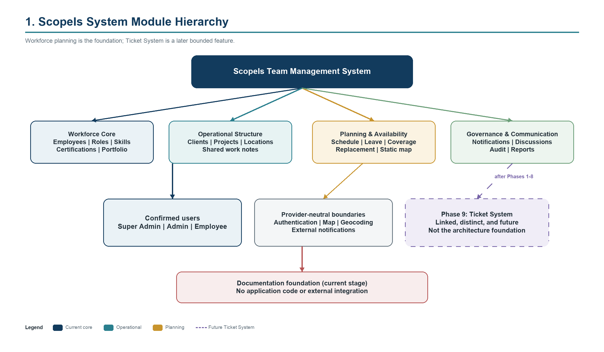
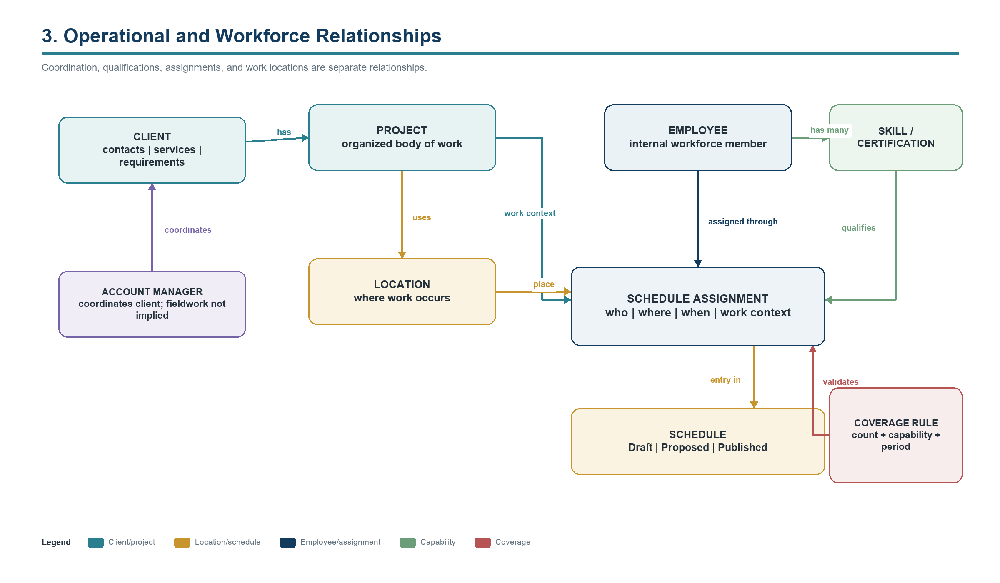
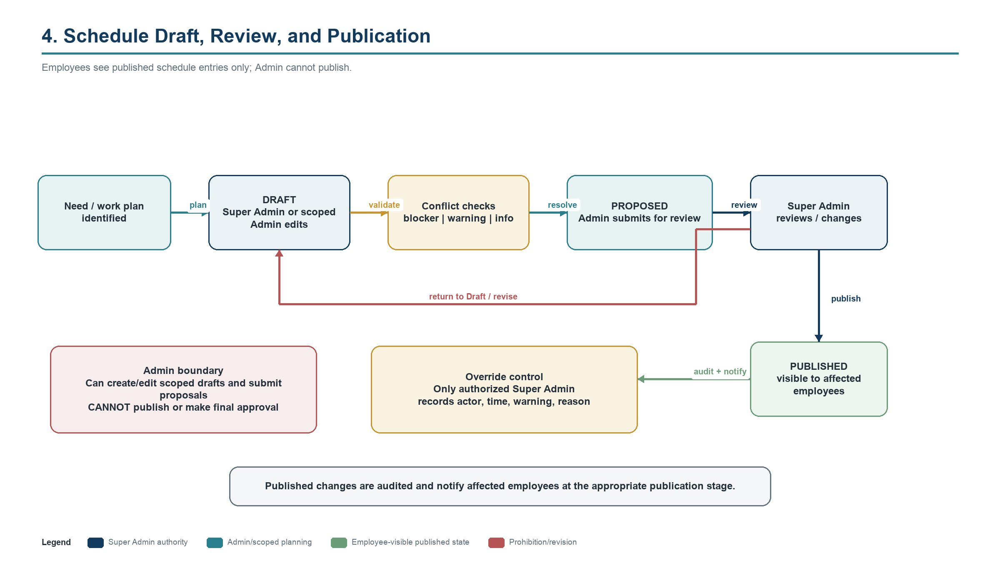
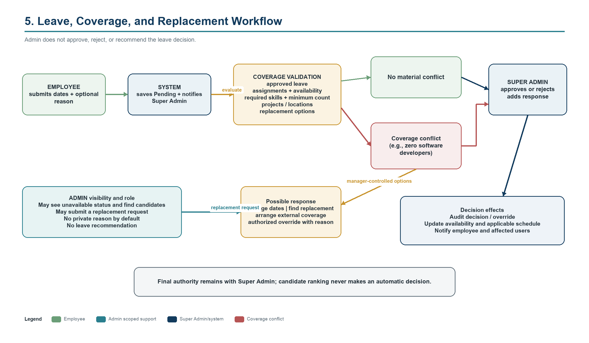
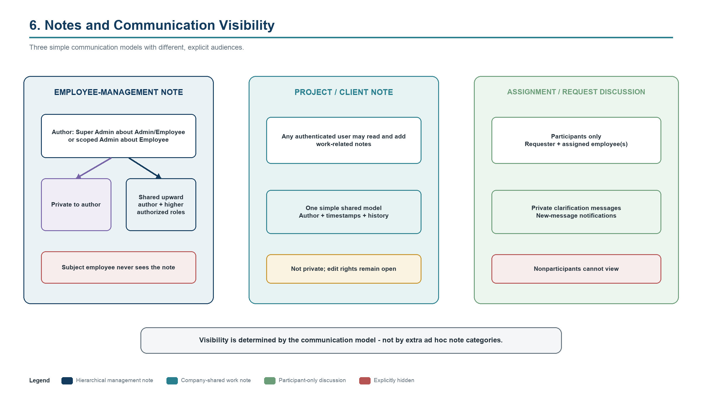
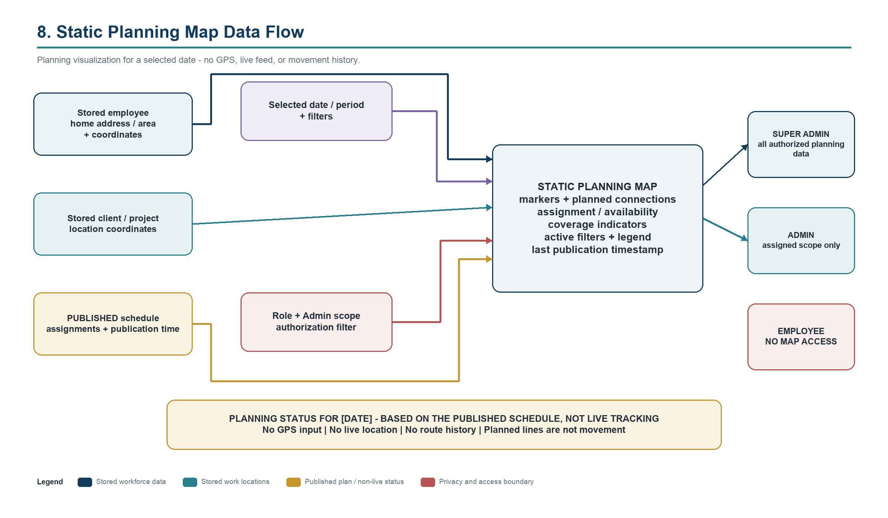
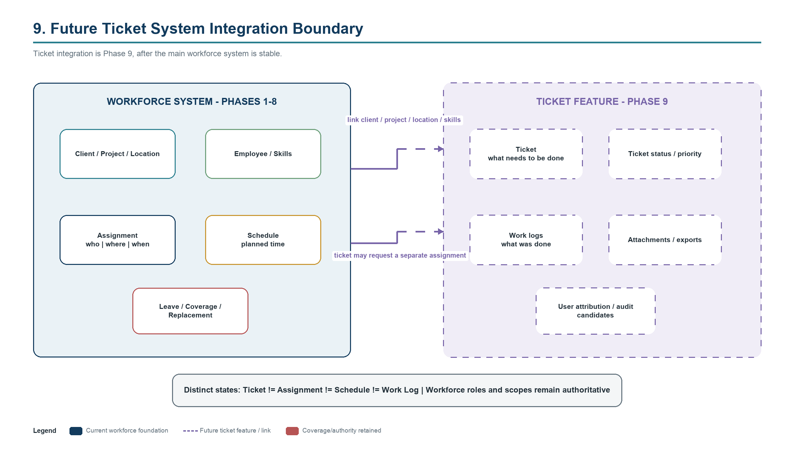

# System Hierarchy and Relationships

## Module hierarchy

The product has a workforce core (employees, roles, designations, skills, certifications, portfolio, assignment arrangements), an operational structure (clients, projects, locations), a planning layer (assignments, schedules, leave, availability, coverage, replacements, map), and collaboration/governance services (notes, discussions, notifications, audit, reporting). Ticket functionality attaches only after these foundations are stable.

## Core entity relationships

### Client, project, location, and work

- A **Client** can have many Projects, Locations, contacts, service requirements, scheduled visits, assignments, coverage rules, and shared notes.
- A **Project** belongs to or relates to a Client, can span one or more Locations, and has dates, status, required skills, responsible Admin, employees, schedule entries, and shared notes.
- A **Location** may relate directly to a Client and to one or more Projects. It stores the physical planning point, working/access information, required skills, staffing needs, contacts, and work notes.
- An **Account Manager** coordinates a Client; the relationship does not imply fieldwork.
- A **Schedule Assignment** links an Employee to a date/time and one or more operational references: Client, Project, Location, request, and arrangement label as applicable.
- A **Skill Requirement** identifies qualifications independently from the job designation or Account Manager relationship.

### Employee capabilities

- An Employee has one system Role and one job Designation at a time as presently modeled; multiple designations are not confirmed.
- An Employee can have many Skills, with optional proficiency, experience, notes, coverage eligibility, and future verification.
- An Employee can have many Certifications and portfolio/CV/supporting items.
- A certification or portfolio submission is immediately saved, not held for approval; it creates a Super Admin notification and may later be marked reviewed or verified.
- An Employee may have an assigned Manager, team/department, normal work pattern, home address/area and coordinates, and default location.

### Schedule and availability

- A Schedule contains entries and has a state: Draft, Proposed for review, or Published.
- An Assignment may be full-day, timed, multi-day, recurring, permanent placement, temporary, one-time visit, on-call, client/project/location-linked, or otherwise confirmed.
- Employees see Published entries only. Admins see and edit drafts within scope; Super Admin sees all drafts and publishes.
- Availability is derived from working patterns, schedule entries, approved leave, and confirmed rules. An arrangement label is descriptive only.

### Leave, coverage, and replacement

- A Leave Request belongs to an Employee and contains dates, optional reason, status, response, and audit information.
- Leave approval evaluates assignments, required skills, minimum coverage, replacement availability, locations/projects, and existing approved leave.
- A Coverage Rule can apply globally or to a client, project, location, skill, date/time, required count, skill level, or certification.
- Replacement matching reads capability, availability, workload, work hours, restrictions, leave, and optional geography. It produces candidates, not an automatic final choice.
- An Admin Replacement Request links the gap, candidates considered, requester, proposed replacement, Super Admin decision, schedule update, and notifications.

### Notes and discussions

- An Employee-Management Note links subject employee, author, author role at creation, visibility, audit timestamps/history, and archived/deleted state. Visibility is private to author or shared upward.
- A Project/Client Note links its parent, author, timestamps, content, and edit/deletion history; all authenticated users can read and add notes.
- An Assignment/Request Discussion belongs to the assignment/request and includes only requester and assigned employee(s).

### Notifications and audit

Each Notification has a recipient, event, related record, timestamp, read/unread state, direct-navigation target, and optional archive state. Audit history records significant changes including publication, post-publication edits, leave decisions, replacements, note edits/deletion, role/scope changes, and overrides with reasons.

### Static planning map

The map combines stored employee home location/area, stored client/project location coordinates, the published schedule, a selected date/period, and scope-aware filters. It is a static planning visualization with a publication timestamp and explicit non-live status. No GPS feed or movement history exists.

## Future Ticket System boundary

A future Ticket can relate to Client, Project, Location, requester, assignee(s), required skills, due date, schedule assignment, work logs, and attachments. Ticket status, assignment status, schedule state, and work-log completion remain distinct. Selected ticket capabilities may be migrated in Phase 12 only after the workforce domain and permissions are stable.

