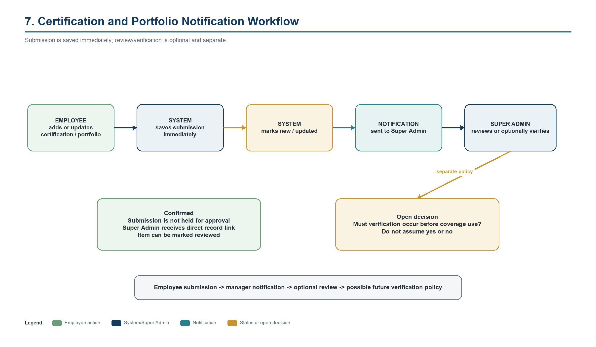

# Workflows

## 1. Employee onboarding and profile setup

1. Super Admin creates a mock account, assigns the system role, job designation, manager, team, status, and permitted work pattern/location fields.
2. Super Admin adds or curates employee skills and proficiency information.
3. Employee signs in and completes permitted contact/profile, certification, portfolio, CV, and project-experience fields.
4. System records audit events for sensitive management changes.
5. Admin visibility is limited by assigned scope; precise home-location visibility remains an open privacy decision.

## 2. Certification or portfolio update

1. Employee adds or changes certification/portfolio information.
2. System saves the submission immediately and marks it new or updated.
3. System sends an in-application notification to Super Admin with a direct record link.
4. Super Admin may mark it reviewed or verified.
5. Whether verification is required before coverage matching is an open decision; there is no mandatory approval gate in the confirmed workflow.

## 3. Client, project, and location setup

1. Super Admin or scoped Admin creates/updates the client record and identifies the coordinating Account Manager.
2. Authorized user creates a project with client, responsible Admin, dates, status, skills, employees, and locations.
3. Authorized user creates/reuses locations with coordinates, site hours, access instructions, contacts, skill/staffing requirements, and shared notes.
4. Coverage rules and later schedule entries reference these records; coordination, fieldwork, qualification, and scheduling stay separate.

## 4. Schedule creation, proposal, and publication

1. Super Admin or scoped Admin creates a Draft on the monthly planning board.
2. Planner adds full-day, timed, recurring, multi-day, permanent, temporary, one-time, on-call, client/project/location assignments.
3. System evaluates confirmed conflicts and displays blockers, warnings, or information.
4. Admin resolves issues or submits the draft as Proposed for review; Admin cannot publish.
5. Super Admin reviews, changes, rejects back to draft, or publishes.
6. Significant overrides record actor, time, warning, and reason.
7. On publication, affected employees receive notifications and can view only their own relevant published schedule.
8. Later published changes are audited and notify affected employees.

## 5. Employee schedule viewing

1. Employee opens My Dashboard or My Schedule.
2. System returns only published entries relevant to that employee.
3. Daily, weekly, and monthly views show dates/times, client, project, location, arrangement label, and work instructions as permitted.
4. Drafts and proposals remain invisible.

## 6. Leave, coverage check, and decision

1. Employee selects one or multiple leave dates and may add a reason.
2. System saves a Pending request and notifies Super Admin.
3. System checks approved leave, assignments, required skills, minimum coverage, replacement availability, and affected projects/locations.
4. Admin may see unavailability but not the reason and does not recommend an outcome.
5. Super Admin approves, rejects, asks for changed dates outside the formal decision, seeks replacement/external coverage, or uses an authorized override with a reason.
6. System updates availability as appropriate, audits the decision, and notifies the employee.

**Scarce-skill scenario:** With two software developers, if one is already on approved leave and the other requests overlapping dates, the system reports that approval would leave zero available software developers. Severity classification is an open policy choice; the warning must be clear and actionable.

## 7. Replacement request

1. Admin identifies an assignment or coverage gap within scope.
2. System lists possible replacements using skills, proficiency, certifications, availability, workload, assignments, location, work hours, restrictions, leave, and optional distance ranking.
3. Admin reviews and submits a replacement request; no automatic final assignment occurs.
4. Super Admin approves, changes, or rejects.
5. If approved, the schedule is updated according to its publication state; published changes are audited and affected employees are notified.

## 8. Static planning map filtering

1. Super Admin or scoped Admin selects a date/date range/month and filters such as employee, skill, client, project, location, arrangement, availability, leave, or coverage problem.
2. System applies role and Admin scope.
3. Map reads stored home area/address (subject to privacy decision), stored worksite coordinates, and the published schedule.
4. It displays planned markers and connections, selected period, active filters, legend, and last publication time.
5. It displays: "Planning status for [selected date] - based on the published schedule, not live tracking."

## 9. Shared Client, Project, and Location notes

1. An authenticated user authorized on the parent record opens that Client, Project, or Location. Super Admin may open any; Admin only one their operational scope authorizes; an Employee cannot reach this surface.
2. The user reads the shared notes and may add a plain-text note of up to 5,000 characters.
3. The system records the author and the create/update times. Only the author may edit; every edit writes the superseded content to `operational_note_revisions` in the same transaction, so nothing is silently overwritten.
4. Only Super Admin may archive a note, and the required reason is retained. Nothing is hard-deleted, and shared-note activity creates no Phase 10 notification.

Implemented in Phase 10. Phase 3 delivered the note record, scope-checked reading and creation, author-only editing, and Super Admin-only reasoned archive; Phase 10 added the preserved revision history and confirmed the access boundary.

## 10. Employee-management note

1. Super Admin selects an Admin or Employee, or scoped Admin selects an Employee.
2. Author writes a management note and selects Private to author or Shared upward.
3. System records subject, author, role at creation, visibility, timestamps/history, and archive/delete state.
4. The subject employee never sees the note. A private note is readable only by its author, including from another Super Admin. A shared-upward note is readable by its author and by an authorized Super Admin whose current scope covers the subject.
5. Content is immutable: a correction archives the old note and creates another. The author or a Super Admin may archive with a reason, and nothing is hard-deleted.
6. The subject, an Employee actor, a peer Admin, and an out-of-scope Admin all receive the same non-enumerating refusal as a nonexistent note.

Implemented in Phase 10 over the schema and policy preserved from Phase 2.

## 11. Participant-only replacement-request discussion

1. A requester or a named employee opens the discussion on a replacement request they participate in.
2. Participants exchange plain-text messages of up to 2,000 characters, ordered by creation time.
3. The system writes the message, a safe audit event with no message content, and one notification per other current participant in a single transaction.
4. No nonparticipant can view the discussion, and role never confers participation. The participant list is recalculated from the request on every read and write.
5. Messages are append-only and immutable; only the author may archive their own message, and nothing is hard-deleted.

Implemented in Phase 10. `replacement_request` is the only supported discussion parent; assignment and Ticket discussions remain out of scope.

## 11a. Notification centre and audit history

1. Each notification belongs to exactly one recipient, who alone may read, mark read or unread, archive, restore, or mark all read.
2. Notification rows store no private display content; titles and summaries derive from the event type, and a related-record link is reauthorized server-side before it is offered.
3. Read state and archive state remain independent, both operations are idempotent, and an inaccessible or unknown target renders a neutral unavailable state.
4. Super Admin can open `/audit` to review recorded actions newest-first, filtered by action, target type, actor, and a bounded date range.
5. Audit rendering uses a per-action safe metadata allowlist; unknown actions show a generic label with no metadata, and raw JSON is never displayed.

Implemented in Phase 10. The central interface completes the persistence foundations delivered in Phase 1; email, SMS, push, and real-time delivery remain out of scope.

## 12. Future ticket-to-assignment relationship

1. A client issue creates a Ticket with location, required skill, due date, and requester.
2. The ticket may initiate a separate assignment request.
3. An approved schedule assignment identifies who, where, and when.
4. Work logs record actual work; ticket and assignment remain linked but maintain independent states.
5. This workflow is implemented only in Phase 12.

